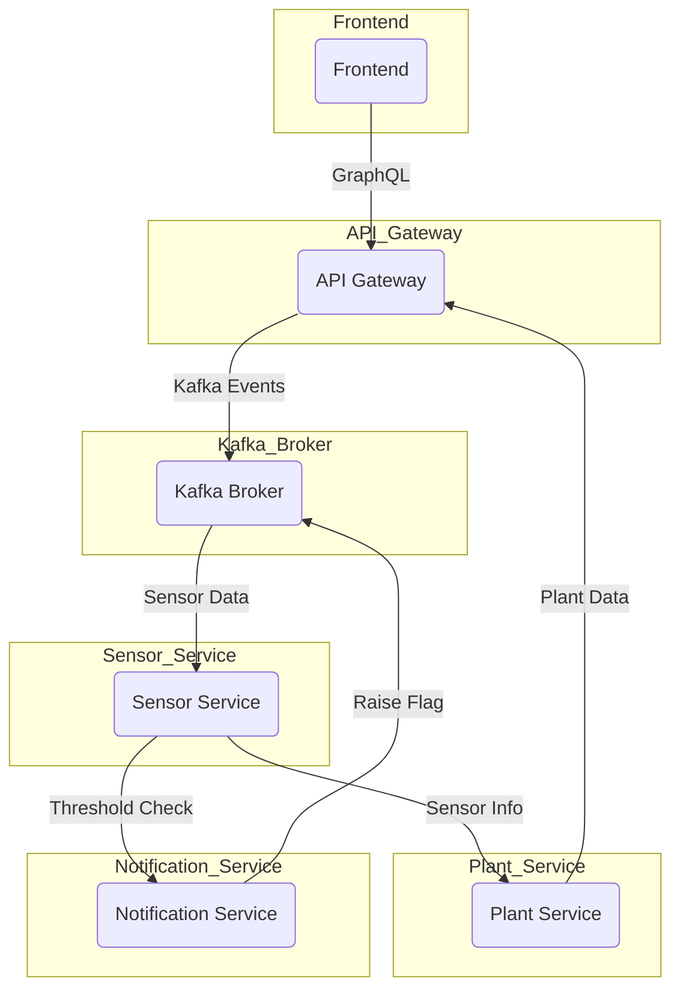

# Global microservices iteractions diagram

+-----------------+       +-------------------+       +------------------+
|                 |       |                   |       |                  |
|   Frontend      | <---- |   API Gateway     | <---- |   Plant Service  |
|                 |       |                   |       |                  |
+-----------------+       +-------------------+       +------------------+
                             |
                             |       +-------------------+
                             +-----> |   Sensor Service  |
                             |       +-------------------+
                             |
                             |       +-------------------+
                             +-----> |   Data Service    |
                                     |   (DB Gateway)    |
                                     +-------------------+
                                     |
                                     |       +------------------------+
                                     +-----> | Notification Service   |
                                             +------------------------+